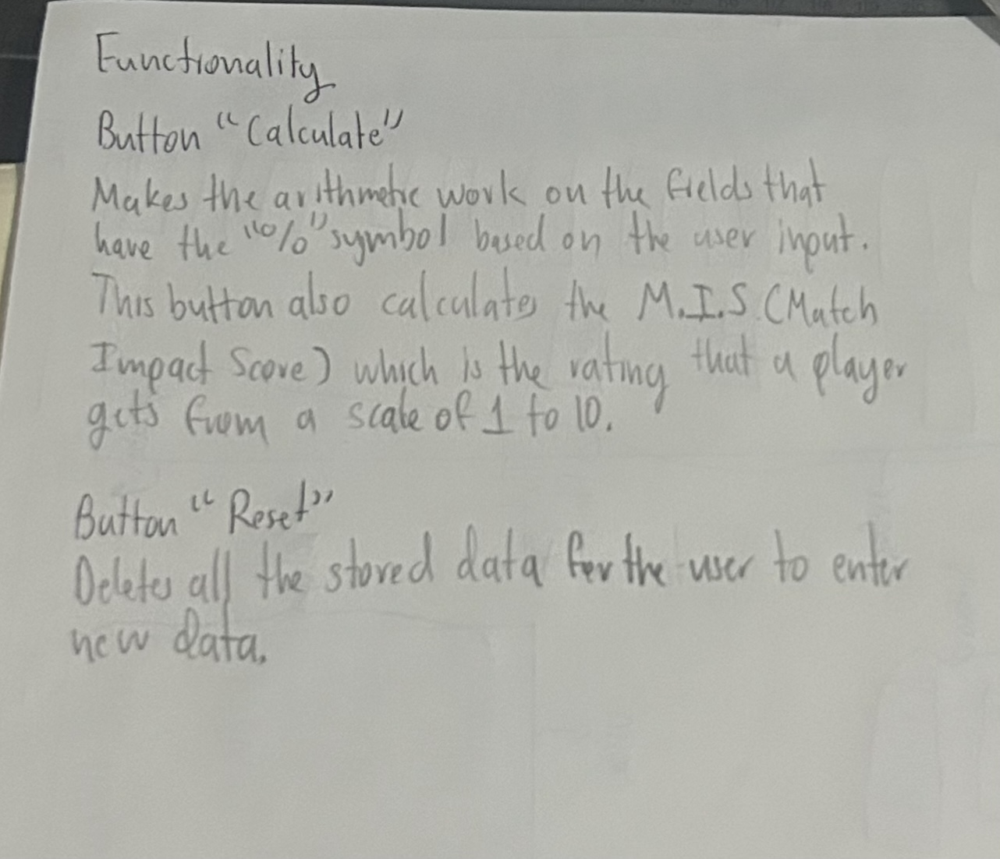
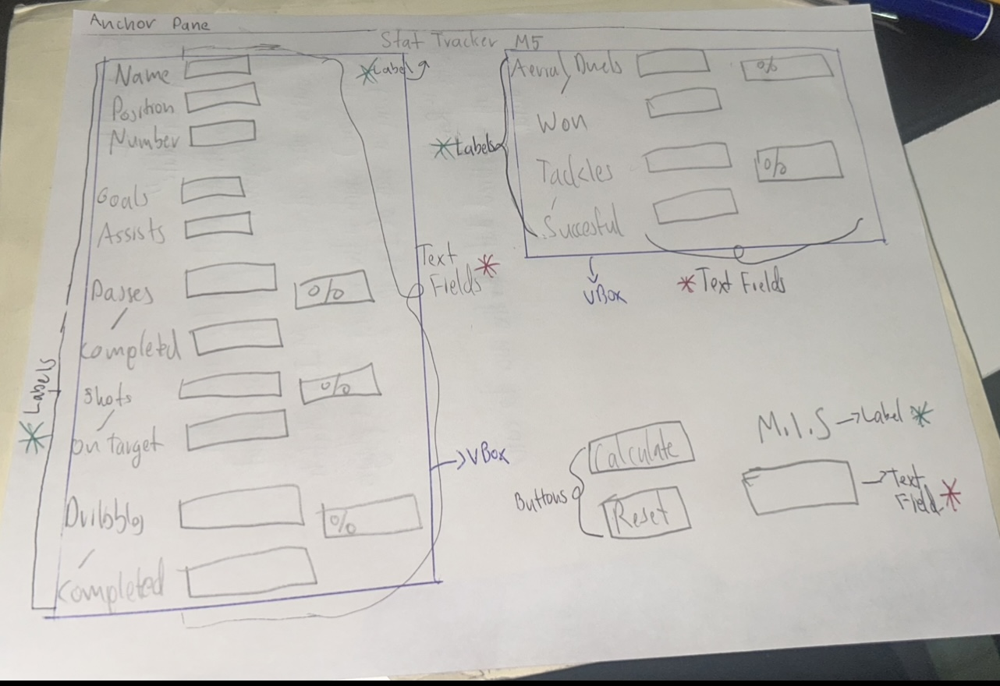

# Final Project GUI
My project will be about soccer
⚽🥅

Use [Markdown](https://www.markdownguide.org/basic-syntax) to format appropriately.
## Final Project Description
_My project will work as a calculator and a stat tracker focused in
soccer. It will track specific stats such as goals, assists, aerial
duels / won, dribbles / successful, etc. The user enters the data 
and clicks on the calculate button and you get certain stats in percentage
and the match impact score out of 10 of the player._

## GUI Wireframe
_Embed your wireframe image(s) here! Here is an example_

